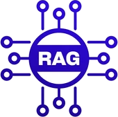
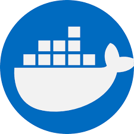

# Sobre o Projeto

Este projeto foi desenvolvido com o objetivo de estudar e aplicar, de forma prática, os conceitos de RAG utilizando LLMs. Além disso, busca demonstrar diretamente no código a implementação e o uso de diversas práticas e ferramentas. A organização dos diretórios não é apresentada como uma abordagem definitiva. A seguir, são detalhadas as práticas e ferramentas utilizadas no projeto.

### ⚙️ Práticas Utilizadas

-  **RAG - Retrieval Argument Generation**  
  
  - Implementação dos princípios fundamentais da Arquitetura Hexagonal (Ports e Adapters).
    
### 📚 Bibliotecas Utilizadas

-  **Swoole** 
  
  - Biblioteca de alto desempenho para aplicações assícronas.  

### 🛠️ Ferramentas Utilizadas 

-  **Docker**  
  - Tecnologia de conteinerização de maquinas virtuais.

-  **Postgres**  
  - Tecnologia de conteinerização de maquinas virtuais.

-  **Ollama**  
  - Container de LLMs.

### 🧠 LLMs utilizadas

-  **Gemma 3**  
  - LLM de raciocínio.

-  **Whisper**  
  - LLM para transcrição de aúdio.

<br><br>

# Instruções e Execução

### Geração do Banco de Dados

* 1 -   No arquivo **phprag.sql** você encontrará o script de criação da estrutura do banco de dados.
* 2 -   Ao subir os containers, bas conectar no banco postgres com um editor de sua preferencia e executar o script
para criação da estrutura do banco de dados.

### Execução do script de ingestão

* Para investão dos dados basta apontar o arquivo dentro do script **scripts/ingest.php**, onde pode ser executado utilizando o proprio container com o comando:

* ```docker exec -it phprag-swoole php scripts/ingest.php```
